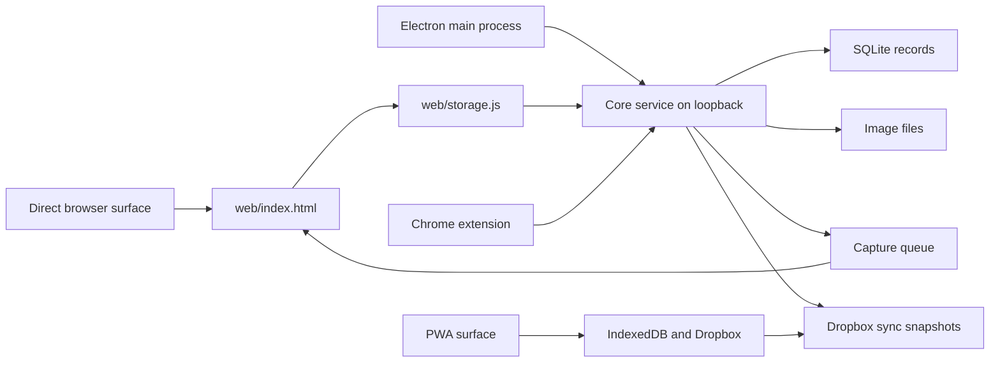

# Architecture and Safety Review — 2026-07-19

Status: baseline review complete; the first safety-hardening implementation slice is now applied in the working tree.

Current disposition: F-01 through F-07 now have implementation coverage or an explicit bounded contract with tests. This document is a review record, not a release approval.

## Baseline

- Repository: `master`, version `1.12.30`, current tip `9432db2`.
- Baseline verification: `node tests/run.js` passed with `ALL TEST FILES PASSED` in approximately 47 seconds.
- Test isolation: the runner creates a throwaway `APPDATA`; no real store or Dropbox library was used.
- The working tree contains untracked local control/scratch directories. They were not modified.

## Architecture model

The architecture has a sound high-level split:

- Pure logic exists for capture routing, URL normalization, merge decisions, and parsers.
- The desktop Core owns SQLite, image files, backups, and the HTTP boundary.
- Desktop sync runs through a worker façade rather than blocking the Electron main process during normal cycles.
- The PWA has a separate IndexedDB/Dropbox adapter but shares the merge contract.
- The renderer remains a zero-build vanilla application, which is an intentional product constraint.

The main architectural debt is that important behavior still crosses several mailbox, full-array, and mirrored-file boundaries without one durable contract or acknowledgement protocol.

## Priority findings

## Current implementation disposition

- F-01 capture acknowledgement: addressed. Core now stores durable queue entries, claims them with leases, and removes them only after an exact id/lease acknowledgement. The renderer acknowledges only after the relevant card/image persistence succeeds.
- F-02 destructive-operation gate: addressed. Core import takes and verifies a safety backup before replacement; UI restore/import paths hard-stop on thrown, failed, or unverified backups and attempt rollback if image restoration fails.
- F-03 same-day backup reconciliation: addressed. Backups use staging, remove stale images, verify SQLite integrity/counts, and verify an image manifest containing size and SHA-256.
- F-04 PWA recovery: addressed. IndexedDB v3 now keeps a complete pre-merge journal and exposes a transactional recovery action; merge aborts safely if the journal cannot be written.
- F-05 Electron shutdown publishing: addressed. The worker façade receives a bounded 8-second final flush; timeout/failure leaves the local state dirty for the next launch.
- F-06 parity: addressed for the formal manifest scope. Exact shared files and required mirrored index contracts are asserted, and the PWA cache is now v37.
- F-07 aggregate sync signature: addressed. Desktop and PWA signatures now include a persisted mutation revision and use the v2 signature prefix.

### F-01 — High: capture delivery is at-most-once, and auto-import is ledgered before renderer persistence

Evidence:

- `core/server.js` clears `ia_capture_queue` as part of `GET /api/captures`.
- `core/autoimport.js` records each new `platformKey` in the ledger before the renderer stores the Imported card.
- `web/index.html` calls `ingestImported()` from `drainCaptures()`.
- `ingestImported()` calls `Store.putCards(imported)` without awaiting its result.

Failure sequence:

1. Core accepts an auto-import and permanently records its platform key.
2. The renderer drains and clears the queue.
3. The renderer crashes, closes, or fails before `Store.putCards()` completes.
4. The item is absent from Imported, but the next platform scrape is blocked by the ledger.

Recommended action:

Design a durable claim/ack protocol before changing the renderer. A capture should remain retryable until the Imported/Saved write is confirmed. The final dedup ledger state should be distinct from “queued but not acknowledged.” Add a failure-injection test that kills or rejects persistence after queue claim and proves the item is retried exactly once.

Do not solve this by simply removing the ledger: that would create duplicate imports after normal retries.

### F-02 — High: destructive legacy restore/import paths do not fail closed on backup failure

Evidence:

- `web/index.html` and `pwa/index.html` call `Store.backupNow()` inside `try/catch` and ignore both thrown errors and `{ok:false, verified:false}` results before replacement writes.
- `core/server.js` exposes `/api/import`, which calls `importLegacyBackup()` directly without taking a safety backup first.
- The native Core restore route has a stronger safety-snapshot gate, so the restore paths do not currently share one safety policy.

Impact:

A failed or unverified safety backup can still be followed by full-array replacement writes. This contradicts the user-facing promise that a verified safety copy is taken first.

Recommended action:

Centralize the destructive-operation gate in Core. The operation must abort unless the safety snapshot returns verified success. Make the UI treat a non-verified response as a hard stop, not a warning. Add tests for thrown backup errors, HTTP failures, `{ok:false}`, and `{ok:true,verified:false}` with an assertion that no replacement write occurs.

### F-03 — Medium: incremental same-day backups do not remove deleted image files

Evidence:

- `core/backup.js` copies only new or size-changed images into the existing dated backup folder.
- It does not remove image files that were deleted from the live store.
- `verifyBackup()` requires the backup image count to equal the current live image count.

Impact:

After a live image deletion, the same-day backup can retain an orphan image and fail verification indefinitely. That blocks safe rotation and makes the newest backup appear unhealthy even when its database is valid.

Recommended action:

Use a staging directory plus atomic completion marker for each backup refresh, or maintain and verify an explicit image manifest so stale files cannot invalidate the current backup. Add a regression test: backup two images, delete one from the live store, back up again, and require verification to pass with one image.

### F-04 — Medium: PWA sync has no local pre-merge recovery snapshot

Evidence:

`pwa/sync-pwa.js` explicitly mirrors the Core sync cycle “minus the safety-backup-before-merge step.” It relies on peer snapshots as the recovery path.

Impact:

IndexedDB writes are grouped by store, but a bad merge or a later publish can make recovery less direct than the desktop path. A peer snapshot is not automatically a byte-for-byte pre-merge local backup.

Recommended action:

Define the PWA recovery contract before optimizing sync further: either create a compact local pre-merge snapshot/journal, or formally prove that the peer snapshot strategy is sufficient for every partial-apply and publish-failure sequence. Test interrupted card writes, settings writes, and image-source-map updates.

### F-05 — Medium: shutdown publishing is synchronous and best-effort

Evidence:

`main.js` performs a synchronous `sync.publishSnapshot()` inside Electron’s `will-quit` handler and swallows failures.

Impact:

With a large image library, shutdown can block or be terminated before the final publish completes. Because the failure is intentionally best-effort, the user receives no explicit “local changes remain unsynced” state from this path.

Recommended action:

Treat periodic worker sync as the authoritative publish path. On shutdown, either wait for a bounded worker flush before quitting or mark the device dirty and surface the last successful publish status on next launch. Add a large synthetic-library shutdown test rather than relying on timing assumptions.

### F-06 — Medium: parity is tested selectively, but the architecture still has multiple mirrored contracts

Evidence:

- `web/` and `pwa/` contain large near-clone renderers.
- `core/merge.js` and `pwa/merge.js` are intended to stay functionally identical but already differ by a wrapper comment.
- Existing parity tests protect important sections, but source scans cannot prove every shared behavior remains aligned.

Recommended action:

Create a small parity manifest covering every required byte-identical file and every behavior-identical contract. Keep the current zero-build workflow; this can be a plain Node assertion script. Require a `SHELL_CACHE` change whenever a cached PWA file changes.

### F-07 — Low / accepted design risk: cheap aggregate content signatures can theoretically collide

`core/merge.js` uses counts and maximum timestamps for publish skipping. This is fast and appropriate for the current scale, but it is not a cryptographic content identity. Multiple writes in the same timestamp window, or a changed non-max row whose timestamp does not exceed the current maximum, could produce the same signature.

Recommended action:

Keep the current optimization until measured otherwise, but add a monotonic durable mutation revision or a cheap mutation counter to the signature contract before relying on publish-skip as a correctness boundary.

## Recommended implementation sequence

1. Reconcile `CLAUDE.md`, `AGENTS.md`, and the current handoff so future reviews use one architecture description.
2. Validate the new PWA recovery journal manually in a browser with a large local library and an interrupted merge simulation.
3. Enable extension pairing protection for the user's installed extension and paste the generated token into its options page.
4. Keep the parity manifest current whenever a shared web/PWA contract is intentionally changed.
5. Run a Windows installer smoke test with shutdown during an active publish.
6. Run performance profiling and optimize full-array persistence, renderer rebuilds, sync signatures, and image scans.

## Optimization plan after the safety gate

Measure with generated synthetic data at 1,000, 5,000, and 10,000 cards:

- startup and boot hydration;
- Imported/Saved filtering and rendering;
- full-array card persistence;
- no-change and changed sync cycles;
- first sync with thousands of images;
- auto-import batch delivery;
- backup refresh after image additions and deletions.

Optimization should target measured costs, preserve the `asOf` reconciliation contract, and avoid a broad renderer or persistence rewrite. The likely first performance wins are reducing unnecessary full-array writes, avoiding phantom `updatedAt` changes, limiting full-library render work, and improving backup image reconciliation.

## Review gates

- F-01/F-02 require a data-contract and data-safety review before implementation.
- Backup, restore, importer, and storage changes require the data-safety reviewer.
- Core, Electron, server, IPC, and extension-bridge changes require the Electron security reviewer.
- A release-readiness review should follow the full isolated test suite and a fresh Windows installer smoke test.

The architecture-and-safety milestone is complete in the working tree. The next gate is manual browser/Electron validation, followed by measured performance optimization and release smoke testing.
